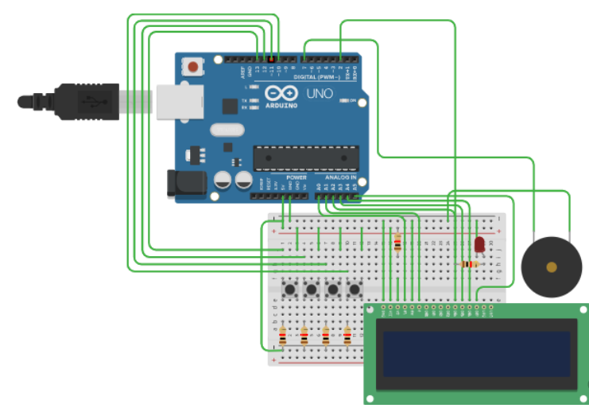
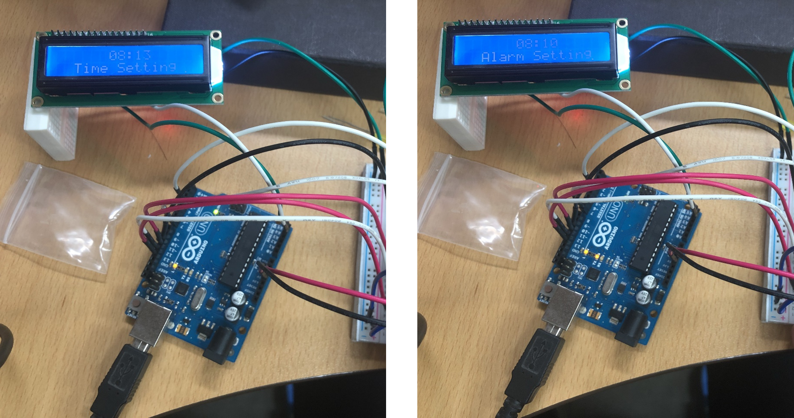
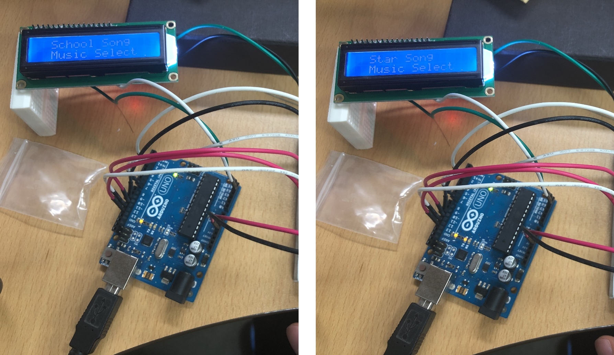

# Arduino-Alarm

Arduino Alarm :: 아두이노 알람

## Info

- 기본 알람 기능
  - 현재 시간 조정

    

  - 알람 시간 조정

    

- 알람 노래 설정
  - 사용자 마다 취향을 고려한 2가지 음악 탑재
    - 학교 종
    - 작은 별
- 기타 기능
  - 알람 중도 해제
  - 버튼 인식 LED

## Finally

- 아두이노 센서 활용 방법에 대해 공부하면서 진행된 프로젝트입니다.
- 설계 및 코드는 [`여기`(Tinkercad)](https://www.tinkercad.com/things/2YdeWCTODI1)에서 확인 가능합니다.

## Copyright

- 비상업적 용도로 사용 가능하며 링크를 반드시 포함해주세요.
- 문제가 되는 내용이 있다면 언제든지 [`issue`](https://github.com/Sotaneum/Arduino-Alarm/issues/new), [`Pull requests`](https://github.com/Sotaneum/Arduino-Alarm/compare) 부탁드립니다.
